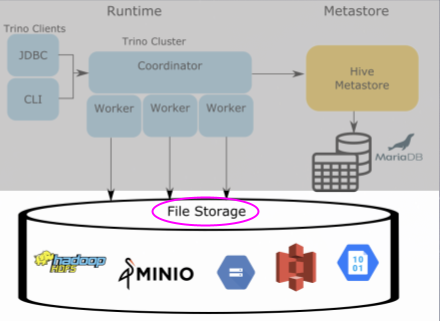
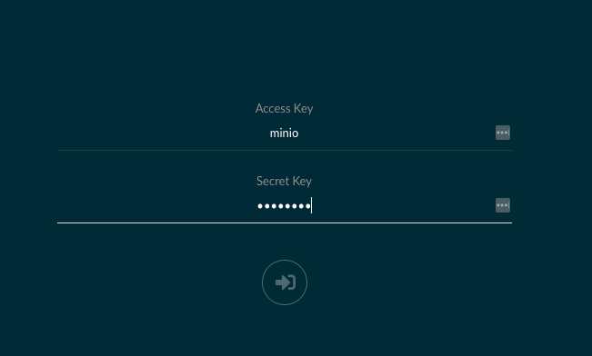
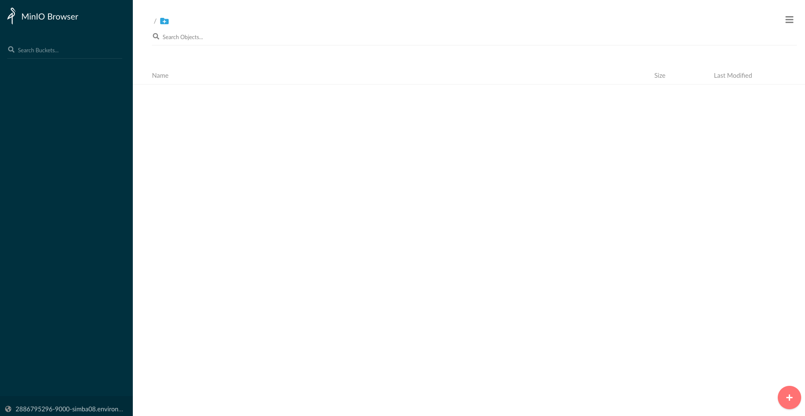
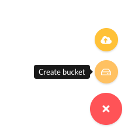
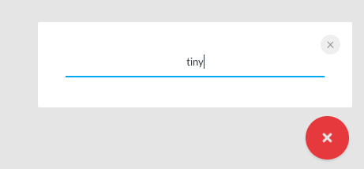
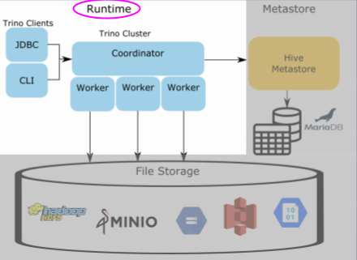
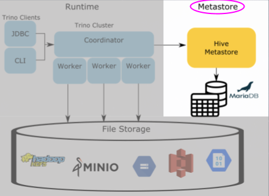

# Building a modern data platform using open source software

## Introduction 
If you are new to Trino, I recommend that you check out the following
blog to get a sense for the Hive connector architecture. [A gentle
 introduction to the Hive connector](https://trino.io/blog/2020/10/20/intro-to-hive-connector.html)


## Goals

TODO: update goals based on further content

In this tutorial, you will:
 1. Learn how to run a CTAS (CREATE TABLE AS) statement in Trino.
 2. Learn the roles of the Trino runtime, metastore, and storage.
 3. Dive into the relational database that contains the Hive model and metadata
    that is stored in the Hive metastore service.
 
## Usefull docker commands

### Start Service

`docker-compose up -d`

### Stop Service

`docker-compose stop`

### Clean Service

[cleans images, containers, and network](shttps://docs.docker.com/config/pruning/)

`docker system prune --all --force`

[cleans volumes](shttps://docs.docker.com/config/pruning/)

`docker volume prune --force`

### Show Service Images 

`docker images`

### Login to Container

`docker container exec -it <container_id> /bin/bash`

### Show Service Logs

`docker logs <container_id>`

### List Services

`docker container ls`

### List Service Process information

`docker-compose ps`

## Open Trino CLI

Once this is complete, you can log into the Trino coordinator node. We will
do this by using the [`exec`](https://docs.docker.com/engine/reference/commandline/exec/)
command and run the `trino` CLI executable as the command we run on that
container. Notice the container id is `trino-minio_trino-coordinator_1` so the
command you will run is:

```
docker container exec -it trino trino
```

When you start this step, you should see the `trino` cursor once the startup
is complete. It should look like this when it is done:
```
trino>
```
 
The first step to understanding the Hive metastore's role in the Hive
connector is to run a CTAS (CREATE TABLE AS) query that pushes data from one of
the TPC connectors into the hive catalog that points to MinIO. The TPC
connectors generate data on the fly so that we can run simple tests like this.

First, run a command to show the catalogs to see the `tpch` and `minio` catalogs
since these are what we will use in the CTAS query.

```
SHOW CATALOGS;
```

You should see that the minio catalog is registered. This is actually a Hive
connector configured under the name `minio` to delineate the underlying storage
we are using.

### Create Bucket in MinIO

If we look at the Trino Architecture, we're first going to prep the file storage
where the actual data will reside. In earlier iterations of big data systems,
this layer was commonly HDFS or other S3 compatible storage and AWS S3. For our
example, we're using MinIO which is also S3 compatible. Creating a bucket gives
us a location to write our data to and we can tell Trino where to find it.



Now, open the [MinIO UI](http://localhost:9000) and log in using:

Access Key: minioadmin

Secret Key: minioadmin



Upon logging in, you will see the following screen. 



Create a Bucket by clicking (+) button and create bucket.



Name the bucket `tiny` as the dataset we will be transferring will be small.



### Querying Trino

Now that we've set up the MinIO bucket, lets move to creating our SCHEMA that
points us to the bucket in MinIO and then run our CTAS query. When we create a
table using CTAS, we're telling the table to copy the table schema and the
data from the source table into the table we're creating. This will make more
sense when you see the query below.

Note: There are two meanings we just used when saying the word "schema".
There is the table schema that defines columns of a table, then there is the
SCHEMA that I intentionally put in all caps that signifies the SCHEMA in the
containment hierarchy used by Trino. Trino defines a CATALOG which contains
multiple SCHEMAS, which contain multiple TABLES. In other databases like
Hive and MySQL



Back in the terminal create the minio.tiny SCHEMA. This will be the first call
to the metastore to save the location of the S3 schema location in MinIO.

```
CREATE SCHEMA minio.tiny
WITH (location = 's3a://tiny/');
```

Now that we have a SCHEMA that references the bucket where we store our tables 
in MinIO, we now can create our first table.

Optional: To view your queries run, log into the 
[Trino UI](http://localhost:8080) and log in using any username (it doesn't
 matter since no security is set up).

Move the customer data from the tiny generated tpch data into MinIO uing a CTAS
query. Run the following query and if you like, watch it running on the Trino UI:

```
CREATE TABLE minio.tiny.customer
WITH (
    format = 'ORC',
    external_location = 's3a://tiny/customer/'
) 
AS SELECT * FROM tpch.tiny.customer;
```

Go back to the [MinIO UI](http://localhost:9000), and click under the tiny 
bucket. You will now see a `customer` directory generated from that table and
underneath that directory will be a file with a name comprised of uuid and date.
This is the orc file generated by the trino runtime residing in MinIO.

Now there is a table under MinIO, you can query this data by checking the
following.
```
SELECT * FROM minio.tiny.customer LIMIT 50;
```

So the question now is how does Trino know where to find the orc file residing
in MinIO when all we specify is the catalog, schema, and table? How does Trino
know what columns exist in the orc file, and even the file it is retrieving
is an orc file to being with? Find out more in the next step.

### Trino security

TODO Configure LDAP with Identity server https://github.com/wso2/docker-is/
TODO Configure LDAP within TRINO
TODO Setup role security example

### Data transformation with dbt without extract and load


The idea of this project is to demonstrate the power of two of the most successful Open Source data projects, dbt and Trino:

- [dbt](https://www.getdbt.com) (data build tool) enables analytics engineers to transform data in their warehouses by simply writing SQL select statements. dbt handles turning these SQL select statements into tables and views ([more details](https://docs.getdbt.com/docs/introduction)).

- [Trino](https://trino.io), formerly [PrestoSQL](https://trino.io/blog/2020/12/27/announcing-trino.html), is a fast distributed SQL query engine for big data analytics that helps you explore your data universe and mix multiple data sources ([more details](https://trino.io/docs/current/overview/use-cases.html)).

So why not use dbt and Trino as a powerful ETL tool ?

Trino connects to multiple and diverse data sources ([available connectors](https://trino.io/docs/current/connector.html)) via 1 connection and process SQL queries at scale and fast, while dbt handles these SQL transformation queries to create tables or views.


With this demonstration and simple project example, you will be able to via a dbt project, join a PostgreSQL table, and write the result into a Iceberg table stored on Minio.

---

#### Configuration: ####

Because of the [PrestoSQL to Trino renaming](https://trino.io/blog/2020/12/27/announcing-trino.html), you need to force protocol header to be named Presto for the dbt-presto plugin to work well with last Trino versions. For that, the additional `protocol.v1.alternate-header-name=Presto` property need to be added in Trino conf file [config.properties](trino_etc/config.properties) ([documentation](https://trino.io/docs/current/admin/properties-general.html?highlight=alternate%20header#protocol-v1-alternate-header-name)).


```
coordinator=true
node-scheduler.include-coordinator=true
http-server.http.port=8080
query.max-memory=5GB
query.max-memory-per-node=1GB
query.max-total-memory-per-node=2GB
discovery-server.enabled=true
discovery.uri=http://localhost:8080
protocol.v1.alternate-header-name=Presto
```

#### Catalogs: ####

You need to define data sources you want to connect via Trino.

For this demonstration we will connect to a Google BigQuery dataset and to an on-premises PostgreSQL database.

**PostgreSQL**

The [postgres.properties](https://github.com/victorcouste/trino-dbt-demo/blob/main/trino_etc/catalog/postgresql.properties) file have to be copied in your etc/catalog Trino folder. You need to set host name, database and credentials of your PostgreSQL database ([Trino doc](https://trino.io/docs/current/connector/postgresql.html)) like:
```
connector.name=postgresql
connection-url=jdbc:postgresql://example.net:5432/database
connection-user=root
connection-password=secret
allow-drop-table=true
```
Note that you need to add the `allow-drop-table=true` so dbt can delete table via Trino.

**BigQuery**

For BigQuery we will connect to the dbt public project dbt-tutorial. The [bigquery.properties](https://github.com/victorcouste/trino-dbt-demo/blob/main/trino_etc/catalog/bigquery.properties) file have to be copied in your etc/catalog Trino folder and you need to set **bigquery.credentials-file** or **bigquery.credentials-key**
([Trino doc](https://trino.io/docs/current/connector/bigquery.html)) with your Google Cloud project key. 

To get this project JSON key file, you can read the [Google documentation](https://cloud.google.com/docs/authentication/getting-started
) or an explanation in [dbt documentation](https://docs.getdbt.com/tutorial/setting-up#create-a-bigquery-project) on BigQuery project and json key file creation.

```
connector.name=bigquery
bigquery.project-id=dbt-tutorial
bigquery.credentials-file=/your_folder/google-serviceaccount.json
```

### dbt

#### Profile:

You need to copy the [trino_profile.yml](https://github.com/victorcouste/trino-dbt-demo/blob/main/trino_profile.yml) file as profiles.yml in your home .dbt folder **~/.dbt/profiles.yml**.

Documentation on [dbt profile](https://docs.getdbt.com/dbt-cli/configure-your-profile) file and on [Presto/Trino profile](https://docs.getdbt.com/reference/warehouse-profiles/presto-profile).

The default catalog is PostgreSQL as we will write in PostgreSQL.

```
trino:
  target: dev
  outputs:
    dev:
      type: presto
      method: none  # optional, one of {none | ldap | kerberos}
      user: admin
      password:  # required if method is ldap or kerberos
      catalog: postgresql
      host: localhost
      port: 8080
      schema: public
      threads: 1
```

#### Project:

In the [dbt project file](https://docs.getdbt.com/reference/dbt_project.yml), [dbt_project.yml](https://github.com/victorcouste/trino-dbt-demo/blob/main/dbt_project.yml), we:
- Use the trino profile
- Define variables for BigQuery catalog **bigquery_catalog** and schema (dataset) **bigquery_schema**
- Set default PostgreSQL catalog and schema for output (under models)

```
name: 'trino_project'
version: '1.0.0'
config-version: 2

profile: 'trino'

source-paths: ["models"]
analysis-paths: ["analysis"]
test-paths: ["tests"]
data-paths: ["data"]
macro-paths: ["macros"]
snapshot-paths: ["snapshots"]

target-path: "target"
clean-targets:
    - "target"
    - "dbt_modules"

vars:
  bigquery_catalog: bigquery
  bigquery_schema: data_prep

models:
  trino_project:
      materialized: table
      catalog: postgresql
      schema: public
```

We need also to define a [dbt Macro](https://docs.getdbt.com/docs/building-a-dbt-project/jinja-macros#macros) to change the way dbt generate and use a new schema (the change between BigQuery and PostgreSQL) in a model. Macro file [generate_schema_name.sql](https://github.com/victorcouste/trino-dbt-demo/blob/main/macros/generate_schema_name.sql).

```


    
    

        {{ default_schema }}

    

        {{ custom_schema_name | trim }}

    


```

#### Model:

In [customers.sql](https://github.com/victorcouste/trino-dbt-demo/blob/main/models/customers.sql) model, you can see that we:
1. Compute the first and last order date and the number of orders per customer from the **jaffle_shop_orders** BigQuery table.
2. Join previous result with the PostgreSQL **jaffle_shop_customers** table.
3. Write the result in a new **customers** PostgreSQL table.


---

## Use the project

[Start the Trino server](https://trino.io/docs/current/installation/deployment.html#running-trino) with `./bin/launcher start`

Trino will listen by default on 8080 port.

For dbt, run the following commands:
- `dbt --version` to check if dbt is well installed with presto-dbt plugin.
- `dbt debug` to check dbt project and connectivity to Trino.
- `dbt seed` to load the [jaffle_shop_customers.csv](/data/jaffle_shop_customers.csv) file in PostgreSQL.
- `dbt compile`to compile (but does not run) the model
- `dbt run` to run the [customers](https://github.com/victorcouste/trino-dbt-demo/blob/main/models/customers.sql) model, do the join with the BigQuery table aggregated and create the **customers** PostgreSQL table.
- `dbt test` to test data quality on 2 columns of the customers table.
- `dbt docs generate` to generate your project documentation.
- `dbt docs serve --port 8001` to starts a webserver on port 8001 to serve your documentation locally.


You can open Trino Web UI started on 8080 port (http://localhost:8080) to check and monitor SQL queries run by dbt.

---

## Extend the project


For input datasets, you can imagine to use the Google BigQuery public dataset [bigquery-public-data](https://cloud.google.com/bigquery/public-data).

You can also change Trino catalog and schema directly in SQL model files with:

```
{{
    config(
        catalog="bigquery",
        schema="data_prep"
     )
}}
```

### Pipeline scheduling and auditing with Dagster

TODO install dagit and dagster daemon
TODO register dbt project with dagster
TODO show scheduling
TODO show auditing

### CDC with Debezium server and redis streams

TODO Setup debezium server
TODO Write to files on minio

### Data transformation with Spark

TODO demonstrate transformation with Spark

### Creating Iceberg tables

TODO explain why iceberg is important

[A gentle introduction to Iceberg]https://trino.io/blog/2021/05/03/a-gentle-introduction-to-iceberg.html)

### Exploring the Hive Metastore



In order for Trino to know where to locate this file, it uses the Hive
metastore to manage and store this information or metadata in a relational
database that the metastore points to, in this case our `mariadb` instance.
Execute the following statement to log into the `mariadb` instance and follow
the remaining commands to learn how the metadata gets split into different
tables. Understanding this model will also solidify the metastore's role in the
scheme of Trino's use of it in the Hive connector.

Open another terminal and run the following command:

```
docker container exec -it "hive-minio_mariadb_1" /bin/bash
```

Once you see the `root@mariadb` terminal, enter into the cli.

```
mysql -uroot -p"$MYSQL_ROOT_PASSWORD"
```

Now that you're in the metastore's database command line interface, you can run 
SQL commands on this database to see where the metadata is stored. First, let's
look at the databases stored in the metastore.

```
SELECT
 DB_ID,
 DB_LOCATION_URI,
 NAME, 
 OWNER_NAME,
 OWNER_TYPE,
 CTLG_NAME
FROM metastore_db.DBS;
```

This shows the databases. What may be strange at first glance, is this is
showing the schema that we created under the database table. This is because
the Hive metastore has two abstractions for its metadata, databases and tables.
Since Trino follows the traditional 3 level ANSI SQL catalog standard, schema
is equivalent to a database. So just as a database contains multiple tables,
a schema will contain multiple tables. Notice the `DB_LOCATION_URI` is in the
bucket location created before in MinIO and set when you created this schema. 
The owner is the `trino` user coming from the user in the trino instance. Also
note the `CTLG_NAME` references the trino catalog.

The next command will show us metadata about the customer table created in the
previous step

```
SELECT 
 t.TBL_ID, 
 t.DB_ID, 
 t.OWNER, 
 t.TBL_NAME, 
 t.TBL_TYPE,
 t.SD_ID
FROM metastore_db.TBLS t 
 JOIN metastore_db.DBS d 
  ON t.DB_ID= d.DB_ID 
WHERE d.NAME = 'tiny';
```

There's nothing unexpected here. You should note that the `DB_ID` matches with
the id of the `tiny` database (ie schema) name. The owner is the same `trino`
user from our trino instance. The `TBL_NAME` is the name of the `customer`
table created in the last step. 

You may notice the location for the table seems to be missing but that
information is actually on another table. The next query will show this
location. Take note of the `SD_ID` before running the next query.

```
SELECT 
 s.SD_ID,
 s.INPUT_FORMAT,
 s.LOCATION,
 s.SERDE_ID 
FROM metastore_db.TBLS t 
 JOIN metastore_db.DBS d
  ON t.DB_ID = d.DB_ID
 JOIN metastore_db.SDS s 
  ON t.SD_ID = s.SD_ID
WHERE t.TBL_NAME = 'customer'
 AND d.NAME='tiny';
```

This table should contain a row that matches the `SD_ID` from the last query
result. You should also see the expected `INPUT_FORMAT` class which since we
specified we were storing orc files it should be the `OrcInputFormat`. Also
notice the `LOCATION` is the schema location we set. If we hadn't set this it
would have defaulted to `<schema_url>/<table_name>`. Then there is the
`SERDE_ID`. SerDe is an abbreviation for serializer/deserializer. This will
point us to another table that contains the information to find which serializer
to use when parsing the file in MinIO.

To find out the serializer used, run the following query:
```
SELECT 
 sd.SERDE_ID,
 sd.NAME,
 sd.SLIB
FROM metastore_db.TBLS t 
 JOIN metastore_db.DBS d
  ON t.DB_ID = d.DB_ID
 JOIN metastore_db.SDS s 
  ON t.SD_ID = s.SD_ID
 JOIN metastore_db.SERDES sd 
  ON s.SERDE_ID = sd.SERDE_ID
WHERE t.TBL_NAME = 'customer'
 AND d.NAME='tiny';
 ```

This is a pretty simple table, you will notice the `NAME` refers to the table
the serializer is used for, and `SLIB` is the serializer library used when
parsing the file in MinIO.

Our last metadata query is looking at the columns on the table.

```
SELECT c.* 
FROM metastore_db.TBLS t
 JOIN metastore_db.DBS d
  ON t.DB_ID = d.DB_ID
 JOIN metastore_db.SDS s
  ON t.SD_ID = s.SD_ID
 JOIN metastore_db.COLUMNS_V2 c
  ON s.CD_ID = c.CD_ID
WHERE t.TBL_NAME = 'customer'
 AND d.NAME='tiny'
ORDER by CD_ID, INTEGER_IDX;
  ```

You'll notice that the `COLUMNS_V2` table has a foreign key `CD_ID` to the
`SDS` storage table. Each key will correlate to a specific table and so you'll
see that the columns are for the `customer` table. You can now notice the
`COLUMN_NAME`, `TYPE_NAME`, and the order these fields are expected in the
`INTEGERD_IDX`.

So now you have a working understanding of the Hive metastore and the model
it uses to store metadata about the files that are generated and written to
when inserting using the Hive connector. 
